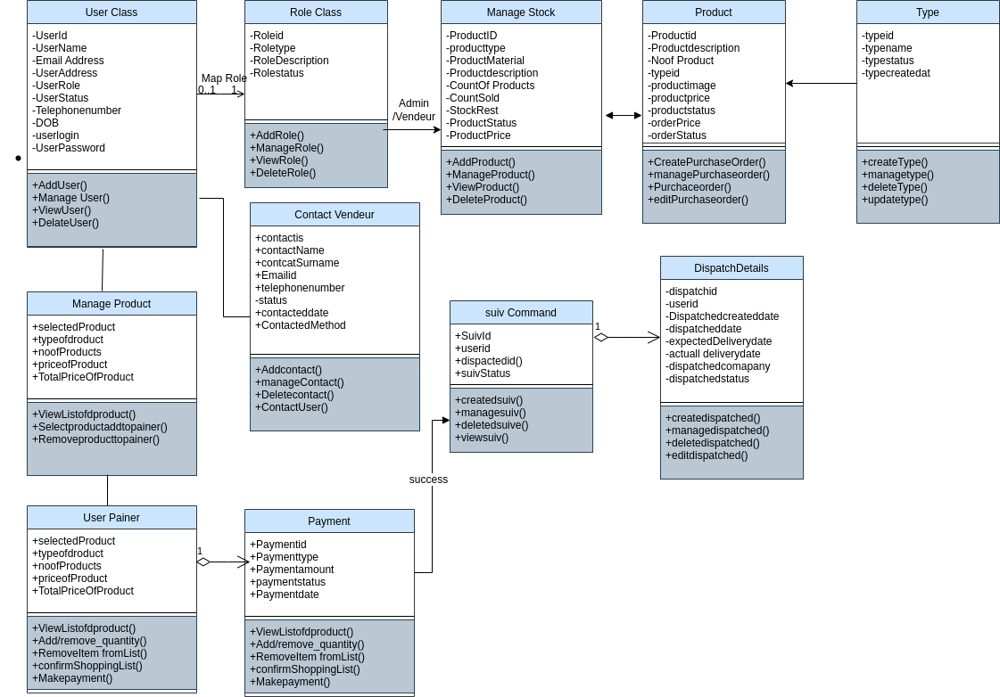

 
 <h2 align="center">UML Class Diagram</h2>
   

The Unified Modeling Language™ (UML®) is a standard visual modeling language intended to be used for 

* Modeling business and similar processes,
* Analysis, design, and implementation of software-based systems.

UML is a common language for business analysts, software architects and developers used to describe, specify, design, and document existing or new business processes, structure and behavior of artifacts of software systems.

# UML Class and Object Diagrams Overview

Class diagram is UML structure diagram which shows structure of the designed system at the level of classes and interfaces, shows their features, constraints and relationships - associations, generalizations, dependencies, etc.

Some common types of class diagrams are:

* Domain model diagram,
* Diagram of implementation classes.

Object diagram could be considered as instance level class diagram which shows instance specifications of classes and interfaces (objects), slots with value specifications, and links (instances of association).

 
# Class Diagram

 A class is a classifier which describes a set of objects that share the same

* features,
* constraints,
* interfacessemantics (meaning).

A class is shown as a solid-outline rectangle containing the class name, and optionally with compartments separated by horizontal lines containing features or other members of the classifier.

Features of a class are 
* Attributes
* Operations.

# Class Diagram

 

