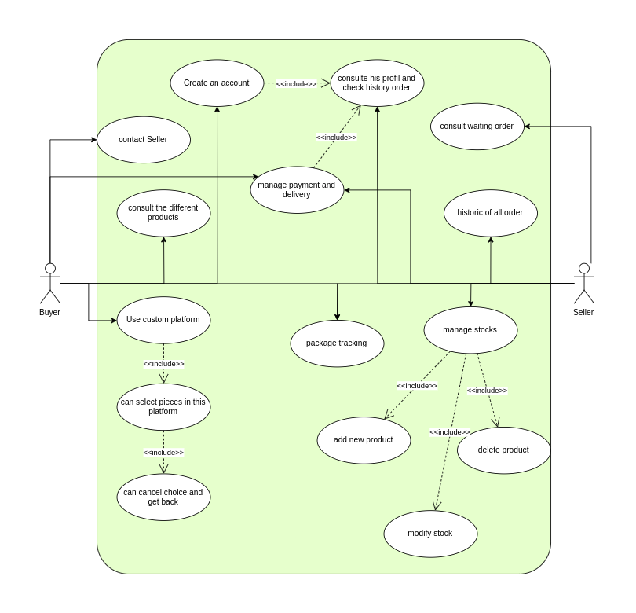

 
 <h2 align="center">UML UseCase Diagram</h2>
   

The Unified Modeling Language™ (UML®) is a standard visual modeling language intended to be used for 

* Modeling business and similar processes,
* Analysis, design, and implementation of software-based systems.

UML is a common language for business analysts, software architects and developers used to describe, specify, design, and document existing or new business processes, structure and behavior of artifacts of software systems.

# UML Use Case Diagrams Overview

In the Unified Modeling Language (UML), a use case diagram can summarize the details of your system's users (also known as actors) and their interactions with the system. To build one, you'll use a set of specialized symbols and connectors. An effective use case diagram can help your team discuss and represent:

* Scenarios in which your system or application interacts with people, organizations, or external systems

*  Goals that your system or application helps those entities (known as actors) achieve

*  The scope of your system

 
# When to apply use case diagrams

 A use case diagram doesn't go into a lot of detail—for example, don't expect it to model the order in which steps are performed. Instead, a proper use case diagram depicts a high-level overview of the relationship between use cases, actors, and systems. Experts recommend that use case diagrams be used to supplement a more descriptive textual use case.

UML is the modeling toolkit that you can use to build your diagrams. Use cases are represented with a labeled oval shape. Stick figures represent actors in the process, and the actor's participation in the system is modeled with a line between the actor and use case. To depict the system boundary, draw a box around the use case itself.

UML use case diagrams are ideal for:

* Representing the goals of system-user interactions

* Defining and organizing functional requirements in a system

* Specifying the context and requirements of a system

* Modeling the basic flow of events in a use case

# Common components include:
To answer the question, "What is a use case diagram?" you need to first understand its building blocks. Common components include:

* Actors: The users that interact with a system. An actor can be a person, an organization, or an outside system that interacts with your application or system. They must be external objects that produce or consume data.

* System: A specific sequence of actions and interactions between actors and the system. A system may also be referred to as a scenario.

* Goals: The end result of most use cases. A successful diagram should describe the activities and variants used to reach the goal.

# Class Diagram

 

