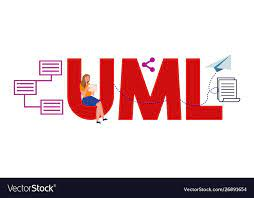
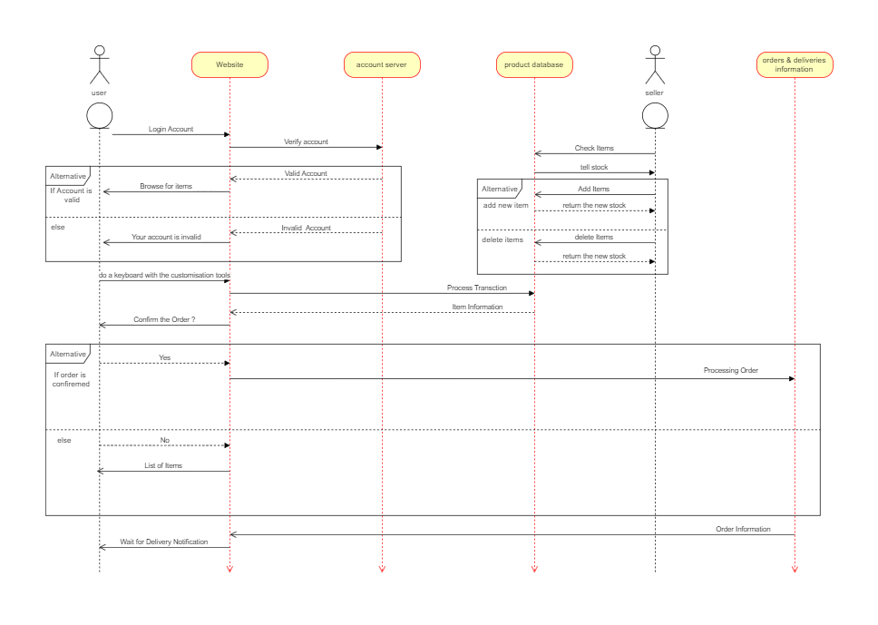

 
 <h2 align="center">UML Sequence Diagram</h2>
   

The Unified Modeling Language™ (UML®) is a standard visual modeling language intended to be used for 

* Modeling business and similar processes,
* Analysis, design, and implementation of software-based systems.

UML is a common language for business analysts, software architects and developers used to describe, specify, design, and document existing or new business processes, structure and behavior of artifacts of software systems.

# UML Sequence Diagrams Overview

 A sequence diagram is a form of interaction diagram which shows objects as lifelines running down the page, with their interactions over time represented as messages drawn as arrows from the source lifeline to the target lifeline. Sequence diagrams are good at showing which objects communicate with which other objects; and what messages trigger those communications. Sequence diagrams are not intended for showing complex procedural logic.

 
# When to apply use case diagrams

## Lifelines

A lifeline represents an individual participant in a sequence diagram. A lifeline will usually have a rectangle containing its object name. If its name is "self", that indicates that the lifeline represents the classifier which owns the sequence diagram.

 

## Messages

Messages are displayed as arrows. Messages can be complete, lost or found; synchronous or asynchronous; call or signal. In the following diagram, the first message is a synchronous message (denoted by the solid arrowhead) complete with an implicit return message; the second message is asynchronous (denoted by line arrowhead), and the third is the asynchronous return message (denoted by the dashed line).

##  Execution Occurrence

A thin rectangle running down the lifeline denotes the execution occurrence, or activation of a focus of control. In the previous diagram, there are three execution occurrences. The first is the source object sending two messages and receiving two replies; the second is the target object receiving a synchronous message and returning a reply; and the third is the target object receiving an asynchronous message and returning a reply.

##  Self Message

A self message can represent a recursive call of an operation, or one method calling another method belonging to the same object. It is shown as creating a nested focus of control in the lifeline’s execution occurrence.

## Lost and Found Messages

Lost messages are those that are either sent but do not arrive at the intended recipient, or which go to a recipient not shown on the current diagram. Found messages are those that arrive from an unknown sender, or from a sender not shown on the current diagram. They are denoted going to or coming from an endpoint element.

## Lifeline Start and End

A lifeline may be created or destroyed during the timescale represented by a sequence diagram. In the latter case, the lifeline is terminated by a stop symbol, represented as a cross. In the former case, the symbol at the head of the lifeline is shown at a lower level down the page than the symbol of the object that caused the creation. The following diagram shows an object being created and destroyed.

## Duration and Time Constraints

By default, a message is shown as a horizontal line. Since the lifeline represents the passage of time down the screen, when modelling a real-time system, or even a time-bound business process, it can be important to consider the length of time it takes to perform actions. By setting a duration constraint for a message, the message will be shown as a sloping line.

 
# Sequence Diagram

 

